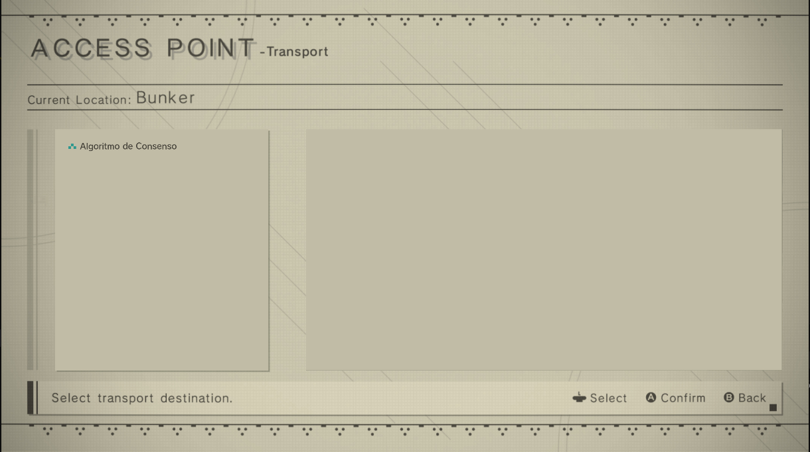
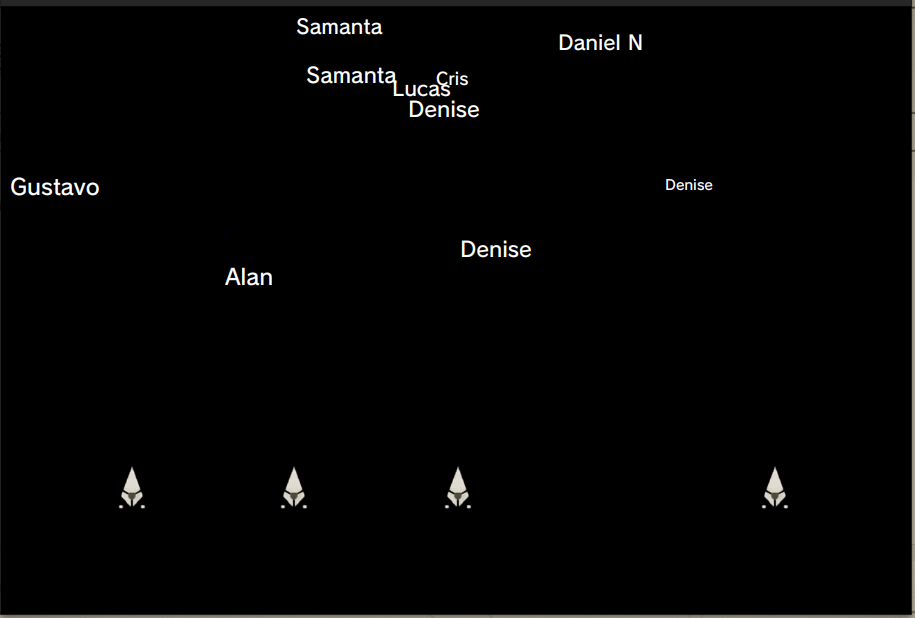

# Classe Nave

A classe `Nave` representa uma espaçonave em um sistema distribuído. Ela estende a classe `Thread` e é responsável por lidar com várias funcionalidades relacionadas à eleição de líder, comunicação com outras espaçonaves e ataque a um alvo.

## Atributos

- `x`: Double - Coordenada X da espaçonave.
- `y`: Double - Coordenada Y da espaçonave.
- `tiros`: Lista de `Tiro` - Lista para armazenar os tiros disparados pela espaçonave.
- `porta`: Inteiro - Número da porta associado à espaçonave.
- `cooldownTiro`: Inteiro - Tempo de espera entre os disparos.
- `cooldownAtual`: Inteiro - Tempo de espera atual.
- `isLeader`: Booleano - Indica se a espaçonave é a líder.
- `id`: Inteiro - Identificador único da espaçonave.
- `sistemaDistribuido`: Instância de `SistemaDistribuido` - Referência ao sistema distribuído.
- `liderancaSemaphore`: Instância de `LiderancaSemaphore` - Semáforo para controlar a liderança.
- `processoEleitoral`: Instância de `ProcessoEleitoral` - Processo eleitoral para a eleição de líder.
- `liderAtual`: Inteiro - Identificador do líder atual.
- `aguardandoRespostas`: Booleano - Indica se a espaçonave está aguardando respostas.
- `alvoAtual`, `alvoEscolhido`: Instâncias de `Inimigo` - Alvo atual e escolhido para o ataque.
- `serverSocket`: Instância de `ServerSocket` - Soquete para receber mensagens.
- `alvoCompartilhado`: Instância de `AlvoCompartilhado` - Alvo compartilhado entre as espaçonaves.
- `controleAlgoritmoConsenso`: Instância de `ControleAlgoritmoConsenso` - Controle para o algoritmo de consenso.

## Construtor

```java
public Nave(int id, SistemaDistribuido sistemaDistribuido, ControleAlgoritmoConsenso controleAlgoritmoConsenso)
```

- Inicializa a espaçonave com o ID fornecido, uma referência ao sistema distribuído (`sistemaDistribuido`) e controle para o algoritmo de consenso (`controleAlgoritmoConsenso`).

## Métodos

### `ouvirMensagens()`

- Escuta mensagens recebidas, lida com mensagens de eleição e de seleção de alvo.

### `iniciarEleicao()`

- Inicia o processo de eleição, envia mensagens de eleição para outras espaçonaves e aguarda as respostas.

### `responderEleicao(int proponenteId): boolean`

- Responde a uma mensagem de eleição e decide se aceita a proposta de liderança.

### `atacar(Inimigo alvo)`

- Ataca o alvo especificado, reduzindo sua vida.

### `responderEleicao(MensagemEleicao mensagem)`

- Responde a uma mensagem de eleição e decide se aceita a proposta de liderança com base em uma chance aleatória.

### `getHostName(): String`

- Retorna o nome do host associado à espaçonave.

### `getPorta(): int`

- Retorna o número da porta associado à espaçonave.

### `enviarMensagemEleicao(Nave destinatario, MensagemEleicao mensagem)`

- Envia uma mensagem de eleição para a espaçonave especificada.

### `enviarComandoDeAtaque(Inimigo alvo)`

- Envia um comando de ataque para outras espaçonaves, especificando o alvo.

### `run()`

- Método de execução principal para a thread da espaçonave, lida com a eleição de liderança e ações de ataque em um loop.

```markdown

```


# Classe AlvoCompartilhado

A classe `AlvoCompartilhado` implementa o padrão Singleton para fornecer uma instância única compartilhada entre diferentes partes do código. Ela gerencia o alvo atual a ser atacado pelas naves no sistema distribuído.

## Atributos

- `instancia`: Instância estática de `AlvoCompartilhado` - Única instância da classe.
- `alvoAtual`: Instância de `Inimigo` - Representa o alvo atual a ser atacado.

## Construtor

```java
private AlvoCompartilhado()
```

- Construtor privado para garantir que apenas uma instância seja criada.

## Método Estático

### `getInstance(): AlvoCompartilhado`

- Retorna a instância única da classe `AlvoCompartilhado`.

## Métodos de Acesso Sincronizados

### `getAlvoAtual(): Inimigo`

# Classe Inimigo

A classe `Inimigo` representa um inimigo no contexto do sistema distribuído. Ela implementa a interface `Serializable` para possibilitar a serialização de objetos. A classe possui atributos que representam a identificação do inimigo e sua vida, além de métodos para manipular a vida do inimigo.

## Atributos

- `id`: Inteiro - Identificador único do inimigo.
- `vida`: Inteiro - Valor representando a vida do inimigo.
- `controleAlgoritmoConsenso`: Instância de `ControleAlgoritmoConsenso` - Controle para o algoritmo de consenso.

## Construtores

### `Inimigo(int id)`

- Inicializa o inimigo com o ID fornecido e gera um valor aleatório para a vida entre 20 e 119.

### `Inimigo(int id, int vida, ControleAlgoritmoConsenso controleAlgoritmoConsenso)`

- Inicializa o inimigo com o ID, a vida e o controle do algoritmo de consenso fornecidos.

## Métodos

### `getId(): int`

- Retorna o ID do inimigo.

### `getVida(): int`

- Retorna a vida atual do inimigo.

### `diminuirVida(int dano)`

- Reduz a vida do inimigo com base no valor de dano fornecido. O método assegura que o dano seja positivo e menor ou igual ao ID do inimigo.

### `gerarVidaAleatoria(): int`

- Gera um valor aleatório para a vida do inimigo entre 20 e 119.

# Classe LiderancaSemaphore

A classe `LiderancaSemaphore` implementa o padrão Singleton para fornecer uma instância única de semáforo. Este semáforo é utilizado para controlar a liderança em um ambiente concorrente, permitindo que apenas uma nave assuma a liderança por vez.

## Atributos

- `instance`: Instância estática de `LiderancaSemaphore` - Única instância da classe.
- `semaphore`: Instância de `Semaphore` - Semáforo utilizado para controle de liderança.

## Construtor

```java
private LiderancaSemaphore()
```

- Construtor privado que inicializa o semáforo com uma permissão.

## Método Estático

### `getInstance(): LiderancaSemaphore`

- Retorna a instância única da classe `LiderancaSemaphore` utilizando o padrão Singleton.

## Métodos de Controle do Semáforo

### `adquirir() throws InterruptedException`

- Adquire uma permissão do semáforo. Pode lançar `InterruptedException` se a thread for interrompida enquanto aguarda.

### `liberar()`

- Libera uma permissão no semáforo.


# Classe MensagemEleicao

A classe `MensagemEleicao` implementa a interface `Serializable` e representa uma mensagem utilizada no processo de eleição dentro do sistema distribuído. A mensagem contém o ID da nave de origem.

## Atributos

- `idOrigem`: Inteiro - Identificador da nave de origem que envia a mensagem.

## Construtor

### `MensagemEleicao(int idOrigem)`

- Inicializa a mensagem com o ID da nave de origem.

## Método

### `getIdOrigem(): int`

- Retorna o ID da nave de origem contido na mensagem.

**Nota:** Esta documentação fornece uma visão geral da classe `MensagemEleicao` e de seus construtores, métodos e atributos. Documentação adicional pode ser necessária para uma compreensão abrangente da funcionalidade da classe.


# Classe Musicas

A classe `Musicas` é responsável por manipular a reprodução de músicas no contexto do sistema distribuído. Ela utiliza a biblioteca `javax.sound.sampled` para carregar e reproduzir arquivos de áudio.

## Atributos

- `clip`: Instância de `Clip` - Objeto utilizado para controlar a reprodução do áudio.

## Construtor

### `Musicas(Clip clip)`

- Inicializa a classe com uma instância de `Clip`.

## Métodos

### `audioIniciarAlgoritmo(File musicFile)`

- Inicia a reprodução de uma música a partir de um arquivo fornecido. O método utiliza a biblioteca `javax.sound.sampled` para carregar e reproduzir o áudio.

### `interromperMusica()`

- Interrompe a reprodução da música e fecha a instância do `Clip`.

**Nota:** Esta documentação fornece uma visão geral da classe `Musicas` e de seus construtores, métodos e atributos. Documentação adicional pode ser necessária para uma compreensão abrangente da funcionalidade da classe.


# Classe ProcessoEleitoral

A classe `ProcessoEleitoral` implementa o padrão Singleton para representar o processo eleitoral em um sistema distribuído. Essa classe controla a eleição de líderes, mantendo informações sobre o líder atual e o número de respostas positivas recebidas durante o processo de eleição.

## Atributos

- `instancia`: Instância estática de `ProcessoEleitoral` - Única instância da classe.
- `isLeader`: Booleano - Indica se a nave é o líder ou não.
- `liderAtual`: Inteiro - Identificador da nave que é o líder atual.
- `numeroDeRespostasPossitivas`: Inteiro - Número de respostas positivas recebidas durante o processo de eleição.

## Construtor

```java
private ProcessoEleitoral()
```

- Construtor privado que inicializa os atributos relacionados ao processo eleitoral.

## Método Estático

### `getInstance(): ProcessoEleitoral`

- Retorna a instância única da classe `ProcessoEleitoral` utilizando o padrão Singleton.

## Métodos de Controle do Processo Eleitoral

### `setLiderAtual(int liderAtual)`

- Define o identificador da nave que é o líder atual.

### `setIsLeader(boolean isLeader)`

- Define se a nave é o líder ou não.

### `setRespostasPositiva()`

- Incrementa o número de respostas positivas recebidas durante o processo de eleição.

### `getNumeroDeRespotasPositivas(): int`

- Retorna o número de respostas positivas recebidas.

### `zeraNumeroDeRespostasPositivas()`

- Zera o número de respostas positivas, utilizado após o término do processo de eleição.

### `getLiderAtual(): int`

- Retorna o identificador da nave que é o líder atual.

### `getIsLeader(): boolean`

- Retorna verdadeiro se a nave é o líder, falso caso contrário.


# Classe SistemaDistribuido

A classe `SistemaDistribuido` representa um sistema distribuído que gerencia naves e inimigos. Esta classe possui métodos para registrar naves e inimigos, iniciar o jogo, criar naves e inimigos automaticamente, escolher alvos, entre outras funcionalidades.

## Atributos

- `naves`: Lista de naves no sistema distribuído.
- `inimigos`: Lista de inimigos no sistema distribuído.
- `jogoEmexecucao`: Booleano que indica se o jogo está em execução.

## Construtor

```java
public SistemaDistribuido()
```

- Inicializa as listas de naves e inimigos.

## Métodos

### `registrarNave(Nave nave)`

- Registra uma nave no sistema distribuído.

### `registrarinimigo(Inimigo inimigo)`

- Registra um inimigo no sistema distribuído.

### `iniciarJogo()`

- Inicia o jogo, com lógica de coordenação para escolher qual inimigo atacar.

### `criarNavesAutomaticamente(int quantidade, ControleAlgoritmoConsenso controleAlgoritmoConsenso)`

- Cria automaticamente a quantidade especificada de naves e as registra no sistema.

### `criarInimigosAutomaticamente(int quantidade, ControleAlgoritmoConsenso controleAlgoritmoConsenso)`

- Cria automaticamente a quantidade especificada de inimigos e os registra no sistema.

### `escolherAlvo(): Inimigo`

- Escolhe um alvo dentre os inimigos disponíveis.

### `encontrarAlvoPorID(int idAlvo): Inimigo`

- Encontra um alvo específico com base em seu ID.

### `getNaves(): Nave[]`

- Retorna um array contendo as naves registradas.

### `getNavesList(): List<Nave>`

- Retorna a lista de naves registradas.


# Classe Tiro

A classe `Tiro` representa um tiro disparado por uma nave em um sistema distribuído. Esta classe utiliza animações do JavaFX para movimentar o tiro em direção a um alvo.

## Atributos

- `bulletImage`: `ImageView` representando a imagem do tiro.
- `nave`: `ImageView` representando a nave de origem do tiro.
- `VELOCIDADE_DO_TIRO`: Constante que define a velocidade do tiro.
- `CAMINHO_PARA_IMAGEM_DO_TIRO`: Caminho para a imagem do tiro.
- `origemDoTiroX`: Posição inicial do tiro no eixo X.
- `origemDoTiroY`: Posição inicial do tiro no eixo Y.

## Construtor

```java
public Tiro(ImageView naveDeOrigem)
```

- Inicializa a imagem do tiro com base na nave de origem.

## Métodos

### `getBulletImage(): ImageView`

- Retorna a imagem do tiro.

### `atirar(Label inimigoDeDestino)`

- Dispara o tiro em direção a um alvo representado por um `Label`.

### `tiroEmMovimento(double posicaoInicialEixoX, double posicaoInicialEixoY, double posicaoFinalEixoX, double posicaoFinalEixoY)`

- Executa uma animação de movimento do tiro do ponto inicial ao ponto final.

### `rotacionarParaAtacar(Label alvo)`

- Rotaciona a nave para apontar em direção ao alvo.

### `calcularAngulacaoDoSeno(double posicaoXDaNave, double posicaoYDaNave, double posicaoXDoAlvo, double posicaoYDoAlvo): double`

- Calcula a angulação com base nas posições da nave e do alvo.


# Classe ControleAlgoritmoConsenso

A classe `ControleAlgoritmoConsenso` é responsável por controlar o algoritmo de consenso em um sistema distribuído. Ela gerencia a criação de naves e inimigos, controla a lógica do jogo e implementa animações e interações visuais.

## Atributos

- `startMessageLabel`: `Label` para exibir mensagens iniciais.
- `alvoAtual`: `Label` representando o alvo atual.
- `blackAnchorPane`: `AnchorPane` para posicionar elementos visuais.
- `ship`: `ImageView` representando a nave do jogador.
- `threadParaCriarNaves`: `Thread` para criar novas naves.
- `sistema`: Instância da classe `SistemaDistribuido`.
- `inimigosList`: Lista de `Label` representando os inimigos.
- `POSSIVEIS_INIMIGOS`: Número máximo de inimigos possíveis.
- `posicoesDasNaves`: Array de posições iniciais para as naves.
- `statusDeOcupacaoDasNaves`: Array de status de ocupação das naves.

## Métodos

### `initialize(URL location, ResourceBundle resources)`

- Método de inicialização da classe.
- Configuração de mensagens flutuantes e início da thread para criar novas naves.

### `habilitarMusica()`

- Inicia a reprodução de uma música de fundo durante o algoritmo.
- Interrompe a música ao fechar a aplicação.

### `threadParaCriarNovasNaves(): Thread`

- Cria e retorna uma nova thread para criar naves e iniciar o jogo.

### `mensagemFlutuante(int segundos, Label objetoDaMensagem)`

- Animação de fade para mensagens flutuantes.

### `novaNave()`

- Adiciona uma nova nave à interface gráfica.

### `novoInimigo()`

- Adiciona um novo inimigo à interface gráfica.

### `escolherAlvo(): Label`

- Escolhe um inimigo aleatório como alvo.

### `rotacionarParaAtacar(Label alvo)`

- Rotaciona a nave para apontar para o alvo.

### `calcularAngulacaoDoSeno(double posicaoXDaNave, double posicaoYDaNave, double posicaoXDoAlvo, double posicaoYDoAlvo): double`

- Calcula a angulação com base nas posições da nave e do alvo.

### `atirar()`

- Inicia a ação de atirar, criando um novo objeto de tiro.

### `movimentacao(Node objeto, int duracaoEmSegundos, int posicaoInicialY, int posicaoFinalY)`

- Animação de transição para movimentar objetos na interface gráfica.

### `inimigoAleatorio(int opcao): String`

- Retorna um nome de inimigo aleatório com base na opção fornecida.


# Classe ControleTela

A classe `ControleTela` é responsável por controlar a interface gráfica relacionada ao algoritmo de consenso em um sistema distribuído. Ela gerencia a interação do usuário, exibe informações sobre o algoritmo e inicia a execução do algoritmo em uma nova cena.

## Atributos

- `lockAlgorithm`: Flag para controlar o estado de seleção do algoritmo.
- `algorithmSelected`: Imagem representando o algoritmo selecionado.
- `algorithmUnselected`: Imagem representando o algoritmo não selecionado.
- `consensusAlgorithmImageView`: `ImageView` para exibir a imagem do algoritmo de consenso.
- `startButtonImageView`: `ImageView` para exibir o botão de início.
- `cursorImageView`: `ImageView` representando um cursor.
- `auxStartImageView`: `ImageView` auxiliar para exibir junto ao botão de início.
- `algorithmDescription`: `Label` para exibir a descrição do algoritmo.
- `auxStartPane`: `AnchorPane` auxiliar para posicionar elementos visuais junto ao botão de início.
- `algoritmoRodando`: Instância da classe `Stage` para representar a janela de execução do algoritmo.
- `DESCRICAO_CONSENSO`: Descrição do algoritmo de consenso.

## Métodos

### `consensusAlgorithmImageViewOnMouseClicked(MouseEvent event)`

- Manipula o evento de clique na imagem do algoritmo de consenso.
- Atualiza a interface e exibe informações sobre o algoritmo.

### `setarDescricao(String descricao)`

- Configura a descrição do algoritmo na interface gráfica.

### `consensusAlgorithmImageViewOnMouseEntered(MouseEvent event)`

- Manipula o evento de entrada do mouse na imagem do algoritmo de consenso.
- Atualiza a aparência da imagem.

### `consensusAlgorithmImageViewOnMouseExited(MouseEvent event)`

- Manipula o evento de saída do mouse da imagem do algoritmo de consenso.
- Restaura a aparência da imagem.

### `startButtonImageViewOnMouseClicked(MouseEvent event)`

- Manipula o evento de clique no botão de início.
- Reinicia as escolhas do usuário e inicia uma nova cena para a execução do algoritmo.

### `newScene()`

- Cria uma nova cena para a execução do algoritmo.

### `startButtonImageViewOnMouseEntered(MouseEvent event)`

- Manipula o evento de entrada do mouse no botão de início.
- Torna visível um elemento auxiliar junto ao botão.

### `startButtonImageViewOnMouseExited(MouseEvent event)`

- Manipula o evento de saída do mouse do botão de início.
- Oculta o elemento auxiliar junto ao botão.

### `resetChoices()`

- Reinicia as escolhas do usuário, restaurando a interface para o estado inicial.


# Classe Principal

A classe `Principal` é a classe principal do programa e responsável por iniciar a simulação de entrega de bombas para clientes. Esta documentação fornece uma visão geral da classe e de seus métodos.

## Atributos

- Nenhum atributo específico declarado.

## Métodos

### `main(String[] args)`

- **Função:** Método principal que lança o programa.
- **Parâmetros:** `args` - argumentos essenciais para tornar o arquivo como principal.
- **Retorno:** `void`.

### `start(Stage cenario) throws IOException`

- **Função:** Método que inicia a exibição de telas.
- **Parâmetros:** `cenario` - responsável por permitir o uso de telas.
- **Retorno:** `void`.

### **Nota:**

- O método `start` utiliza a classe `MudancaDeTela` para inicializar a exibição de telas. Detalhes sobre a funcionalidade específica de `MudancaDeTela` não foram fornecidos neste trecho de código, portanto, para uma compreensão abrangente, é recomendável consultar a implementação desta classe.

## Dados Gerais

- **Autores:** Gustavo Pereira Nunes e Weslei Ferreira Santos
- **Início:** 26/09/2023
- **Última Alteração:** 01/12/2023
- **Nome:** Principal
- **Função:** Simular entrega de bombas para clientes.


# Execução do Simulador 



## Algoritmo de Concenso em Execução


